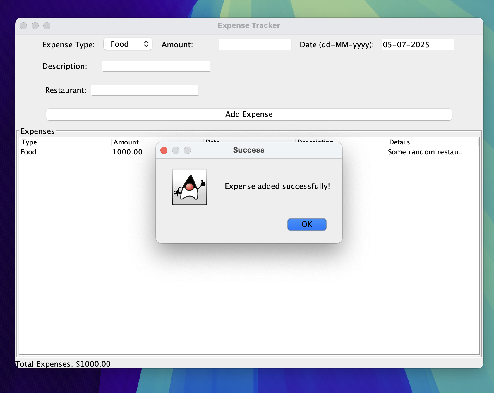

# Expense Tracker



This project is a small Java Swing application used to record everyday expenses. Entries are stored in a local SQLite database so they persist between runs. The main window lets you create a new expense, view all stored expenses and see the running total.

## Features

* **Expense types** – add `Food`, `Travel` and `Utility` expenses. Each type displays a set of fields for additional details (restaurant, destination/transport, or utility name).
* **Total calculation** – a label at the bottom of the window automatically sums all stored expenses.
* **Database storage** – data is saved to `expense_tracker.db` using the schema in [`resources/script_sqlite.sql`](resources/script_sqlite.sql). The file is ignored by git so your data remains local.

## Prerequisites

* Java (JDK 11 or later)
* `sqlite3` command line tool if you want to inspect the DB
* The JDBC driver `sqlite-jdbc-3.50.1.0.jar` which is already included

## Quick start

### Linux/macOS
1. `bash scripts/clean.sh` – create the `bin` directory and remove any old database.
2. `bash scripts/init_db.sh` – create `expense_tracker.db` using the SQL script.
3. `bash scripts/run.sh` – compile sources and launch the GUI (requires a display).

### Windows (PowerShell)
1. `powershell -ExecutionPolicy Bypass -File scripts/windows/clean.ps1`
2. `powershell -ExecutionPolicy Bypass -File scripts/windows/init_db.ps1`
3. `powershell -ExecutionPolicy Bypass -File scripts/windows/run.ps1`

The scripts simply wrap the manual commands shown below and are convenient during development. To keep your existing expense data, back up `expense_tracker.db` before running `init_db.sh` as it deletes the file.

### Manual commands

#### Linux/macOS
```bash
javac -d bin -cp sqlite-jdbc-3.50.1.0.jar $(find src -name "*.java")
java -cp bin:sqlite-jdbc-3.50.1.0.jar gui.ExpenseTrackerGUI
```

#### Windows (PowerShell)
```powershell
$files = Get-ChildItem -Path src -Recurse -Filter *.java | ForEach-Object { $_.FullName }
javac -d bin -cp "sqlite-jdbc-3.50.1.0.jar" $files
java -cp "bin;sqlite-jdbc-3.50.1.0.jar" gui.ExpenseTrackerGUI
```

## Database schema

The SQLite script defines two tables and a pair of triggers:

```sql
PRAGMA foreign_keys = ON;

CREATE TABLE IF NOT EXISTS users (
    user_id    INTEGER PRIMARY KEY AUTOINCREMENT,
    username   TEXT    NOT NULL UNIQUE,
    password   TEXT    NOT NULL,
    created_at DATETIME DEFAULT CURRENT_TIMESTAMP,
    updated_at DATETIME DEFAULT CURRENT_TIMESTAMP
);

CREATE TABLE IF NOT EXISTS expenses (
    expense_id  INTEGER PRIMARY KEY AUTOINCREMENT,
    user_id     INTEGER,
    amount      REAL       NOT NULL,
    date        DATE       NOT NULL,
    description TEXT       NOT NULL,
    type        TEXT       NOT NULL,
    details     TEXT,
    created_at  DATETIME   DEFAULT CURRENT_TIMESTAMP,
    updated_at  DATETIME   DEFAULT CURRENT_TIMESTAMP,
    FOREIGN KEY(user_id) REFERENCES users(user_id)
);

CREATE TRIGGER IF NOT EXISTS trg_users_upd
AFTER UPDATE ON users BEGIN
  UPDATE users SET updated_at = CURRENT_TIMESTAMP WHERE user_id = OLD.user_id;
END;

CREATE TRIGGER IF NOT EXISTS trg_expenses_upd
AFTER UPDATE ON expenses BEGIN
  UPDATE expenses SET updated_at = CURRENT_TIMESTAMP WHERE expense_id = OLD.expense_id;
END;
```

Running `init_db.sh` executes this script to create a fresh database. If you change the schema, modify `resources/script_sqlite.sql` and rerun the script. Existing data will be lost, so copy `expense_tracker.db` elsewhere if you need to migrate.

## Future improvements

* User login using the `users` table
* More expense categories
* Optional CSV export/import
* Better validation and error handling

